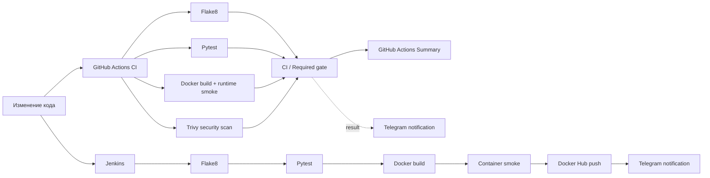

# Jenkins + Docker: CI/CD-пайплайн для QA

[](https://github.com/TokhirjonYuldoshev/my-docker-project/actions/workflows/ci.yml)

Небольшой, но инженерно оформленный QA/DevOps portfolio-проект, который показывает два независимых пути автоматизации качества:

- **GitHub Actions CI** проверяет каждый Pull Request и push в `main` через Flake8, Pytest, Docker runtime smoke и blocking security gate на Trivy;
- **Jenkins delivery pipeline** повторяет quality gates, собирает и smoke-тестирует Docker image, публикует версионный image в Docker Hub и отправляет результат в Telegram;
- **Telegram observability** для GitHub Actions вынесена в отдельный job и не может подменить реальный CI result.

## Архитектура автоматизации



## Что проверяет CI

| Gate | Что подтверждает |
| --- | --- |
| `Quality / Flake8` | Python-код и тесты проходят статическую проверку |
| `Tests / Pytest` | наблюдаемое поведение приложения соответствует контракту |
| `Docker / Build + runtime smoke` | image реально собирается, контейнер стартует и возвращает ожидаемый результат |
| `Security / Trivy container scan` | в образе нет исправляемых `CRITICAL` уязвимостей по политике проекта |
| `CI / Required gate` | все обязательные сигналы завершились успешно |

Unit test и container smoke разделены намеренно: успешный Pytest не доказывает, что Docker packaging и runtime действительно исправны. Security scan также независим от функциональных проверок, поэтому риск уязвимостей виден отдельным merge-сигналом.

## Runtime baseline

Проект стандартизирован на **Python 3.12** для GitHub Actions и Docker runtime. Jenkins требует **Python 3.12+** и fail-fast завершает pipeline, если агент не соответствует baseline.

Docker container запускает приложение не от `root`. CI устанавливает только зафиксированные зависимости из `requirements-dev.txt`, без неявного обновления tooling при каждом запуске.

## GitHub Actions CI

Основной workflow: `.github/workflows/ci.yml`.

Триггеры:

- Pull Request;
- push в `main`;
- ручной `workflow_dispatch`.

Flake8, Pytest, Docker runtime validation и Trivy работают независимыми jobs. Финальный `CI / Required gate` агрегирует их результаты и предоставляет один стабильный сигнал для branch protection. При этом отдельные jobs остаются видимыми для диагностики причины failure.

Workflow использует read-only `contents` permission, явные timeouts и concurrency policy. Устаревшие PR-runs могут отменяться, а post-merge run на `main` доводится до конца, чтобы сохранять подтверждение состояния основной ветки.

## Telegram-уведомления GitHub Actions

После push в `main` и ручного запуска отдельный `Telegram Notification` job отправляет компактный итог:

- общий статус pipeline;
- Flake8 / Pytest / Docker smoke / Trivy / Required gate;
- репозиторий, ветку, автора, event и commit;
- прямую ссылку на конкретный GitHub Actions run.

Уведомление оформляется через Telegram HTML и воспринимается как **observability channel**, а не как источник истины о здоровье сборки. Если Telegram API временно недоступен, реальный CI result не превращается в ложный product failure.

Для GitHub Actions используются repository secrets:

```text
TELEGRAM_BOT_TOKEN
TELEGRAM_CHAT_ID
```

Если secrets отсутствуют, основной CI остаётся зелёным, а notification job явно фиксирует, что отправка пропущена. Для проверки интеграции есть отдельный manual-only workflow `.github/workflows/telegram-test.yml`, который последовательно проверяет `getMe`, `getChat` и `sendMessage` и **падает**, если интеграция настроена некорректно.

## Jenkins delivery pipeline

`Jenkinsfile` выполняет:

1. checkout исходного кода;
2. проверку Python 3.12+;
3. установку pinned development dependencies;
4. Flake8;
5. Pytest;
6. Docker build;
7. container runtime smoke;
8. авторизацию в Docker Hub через Jenkins Credentials;
9. публикацию versioned image;
10. cleanup локального image;
11. Telegram notification о результате.

Pipeline отключает неявный Declarative checkout, потому что checkout контролируется отдельной stage. Builds сериализованы, чтобы избежать конфликтов общего Docker/credential state на агенте, а глобальный timeout не позволяет зависшему delivery занимать executor бесконечно.

Jenkins credentials ожидаются под ID:

```text
docker-hub-credentials
telegram-token
telegram-chat-id
```

Telegram failure в Jenkins не скрывает результат линтинга, тестов, сборки, smoke или публикации image.

## Стек

| Область | Технология |
| --- | --- |
| CI validation | GitHub Actions |
| Delivery automation | Jenkins Declarative Pipeline |
| Язык | Python 3.12 |
| Tests | Pytest 9 |
| Static analysis | Flake8 |
| Container security | Trivy |
| Containerization | Docker |
| Registry | Docker Hub |
| Notifications | Telegram Bot API |
| Dependency maintenance | Dependabot |

## Структура репозитория

```text
my-docker-project/
├── .github/
│   ├── dependabot.yml
│   ├── pull_request_template.md
│   └── workflows/
│       ├── ci.yml
│       └── telegram-test.yml
├── .dockerignore
├── .gitignore
├── Dockerfile
├── Jenkinsfile
├── SECURITY.md
├── app.py
├── test_app.py
├── requirements-dev.txt
└── README.md
```

## Test scope

Приложение намеренно небольшое. Unit test проверяет observable contract функции `get_message()`.

Цель проекта — не искусственно увеличивать количество тестов, а продемонстрировать **качество pipeline design**: статический анализ, test gate, Docker packaging, runtime verification, container security, controlled delivery, cleanup и observability.

## Dependency management

Development tools зафиксированы в `requirements-dev.txt`:

```bash
python -m pip install --disable-pip-version-check -r requirements-dev.txt
python -m flake8 app.py test_app.py --count --statistics
python -m pytest -q
```

Dependabot проверяет Python dependencies, GitHub Actions и Docker base image по расписанию. Обновления приходят Pull Requests и проходят те же quality gates, что обычные изменения. Major/runtime upgrades не auto-merge: compatibility должна быть доказана CI.

## Локальный Docker smoke

Сборка:

```bash
docker build -t shoxrux-app .
```

Запуск:

```bash
docker run --rm shoxrux-app
```

Ожидаемый результат:

```text
Hello from Docker! The application is running successfully.
```

## Security и failure semantics

- secrets и пароли не хранятся в репозитории;
- Trivy — отдельный blocking signal для fixable `CRITICAL` container vulnerabilities;
- quality/test/build/runtime/security/publish failures не маскируются notification или cleanup-логикой;
- notification transport — вспомогательный observability signal;
- политика раскрытия security-проблем описана в `SECURITY.md`;
- PR template заставляет явно оценивать CI/runtime/security risk изменения.

## Почему это QA-проект

Здесь проверяется не только код функции. Проект демонстрирует инженерный контроль качества delivery chain: независимые quality gates, deterministic aggregate result, runtime smoke после сборки контейнера, security scanning, dependency maintenance, failure semantics и диагностируемые уведомления.

---

**Portfolio project by Tokhirjon Yuldoshev**
