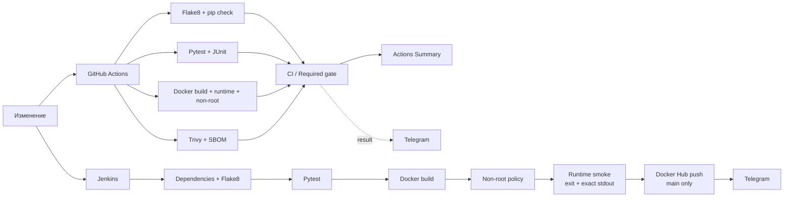

# Jenkins + Docker: CI/CD-пайплайн для QA

[](https://github.com/TokhirjonYuldoshev/my-docker-project/actions/workflows/ci.yml)

Компактный QA/DevOps портфолио-проект, в котором основная ценность находится не в размере Python-приложения, а в **проверяемом pipeline contract**: dependency integrity, lint, tests, Docker runtime, non-root policy, container security, evidence, controlled delivery и observability проверяются отдельными сигналами.

Проект разделяет два пути:

- **GitHub Actions** — merge-validation и регулярная baseline-проверка;
- **Jenkins** — демонстрационный delivery pipeline с публикацией Docker image только из подтверждённой `main`.

Telegram остаётся вспомогательным observability channel и не может подменить реальный CI result.

## Ключевые сигналы

| Сигнал | Что подтверждает | Блокирующий |
| --- | --- | --- |
| `Quality / Flake8` | dependency integrity + статический анализ Python-кода | Да |
| `Tests / Pytest` | observable application contract + JUnit evidence | Да |
| `Docker / Build + runtime smoke` | build, запуск container, exact stdout и non-root runtime | Да |
| `Security / Trivy container scan` | отсутствие fixable `CRITICAL` findings + security evidence | Да |
| `CI / Required gate` | агрегирует все обязательные upstream signals | Да |
| `Telegram Notification` | доставку итогового результата | Нет |

## Архитектура автоматизации



## Runtime baseline

- GitHub Actions и Docker runtime: **Python 3.12**.
- Jenkins: **Python 3.12+**, иначе pipeline fail-fast завершается.
- Development dependencies зафиксированы в `requirements-dev.txt`.
- После установки выполняется `pip check`.
- Container объявляет non-root runtime user; это отдельно проверяется в GitHub Actions и Jenkins.

## GitHub Actions CI

Основной workflow: `.github/workflows/ci.yml`.

Триггеры:

- Pull Request;
- push в `main`;
- `workflow_dispatch`;
- weekly baseline validation по воскресеньям в **03:30 UTC**.

Weekly run повторяет тот же полный baseline и помогает увидеть runtime/security drift даже без нового commit.

### Quality / Flake8

Проверяет:

- целостность установленных Python dependencies через `pip check`;
- Flake8 для приложения, теста и local-preflight automation.

### Tests / Pytest

Проверяет observable contract приложения. JUnit XML сохраняется как Actions artifact на 14 дней и остаётся test evidence для triage.

### Docker / Build + runtime smoke

Проверяет не только факт сборки image, но и runtime:

- image собирается из checked-in source;
- container запускается;
- process exit status успешен;
- stdout точно совпадает с ожидаемым контрактом;
- image metadata объявляет non-root runtime user.

Успешный Pytest или Docker build сами по себе не доказывают исправность runtime packaging.

### Security / Trivy container scan

Trivy блокирует fixable `CRITICAL` container vulnerabilities. JSON report сохраняется как evidence **до enforcement**, а CycloneDX container SBOM сохраняется отдельно. Поэтому даже failed security gate оставляет данные для triage.

### CI / Required gate

Агрегирует независимые quality/test/runtime/security signals и создаёт стабильный required check для branch protection. Причина failure при этом остаётся видна в owning job.

Workflow использует read-only `contents` permission, явные timeouts и concurrency policy. Устаревшие PR-runs могут отменяться, а post-merge и scheduled runs доводятся до конца, чтобы сохранять evidence состояния `main`.

## Telegram-уведомления GitHub Actions

После push в `main`, manual или weekly scheduled run отдельный `Telegram Notification` job отправляет сообщение в том же визуальном стиле, что flagship `pomidorqa-tests`:

- заголовок `Python & Docker CI` и краткое описание;
- крупный итоговый статус: `ВСЕ ПРОВЕРКИ ПРОЙДЕНЫ`, `CI ТРЕБУЕТ ВНИМАНИЯ`, `ЗАПУСК ОТМЕНЁН` или неполный результат;
- репозиторий, ветка, event и автор;
- отдельный `<blockquote>` с Flake8, Pytest, Docker runtime, Trivy/SBOM и `CI / Required gate`;
- заметная ссылка на конкретный GitHub Actions run.

Transport использует Telegram HTML, HTML escaping, timeout, `curl --retry 2 --retry-all-errors` и проверяет HTTP `200` вместе с JSON `.ok == true`.

Repository secrets:

```text
TELEGRAM_BOT_TOKEN
TELEGRAM_CHAT_ID
```

Если secrets отсутствуют или Telegram transport временно недоступен, реальный build/test/security result сохраняется. Для отдельной диагностики есть manual-only `.github/workflows/telegram-test.yml` (`getMe` → `getChat` → `sendMessage`).

## Jenkins delivery pipeline

`Jenkinsfile` выполняет:

1. controlled checkout;
2. проверку Python 3.12+;
3. установку pinned dependencies и `pip check`;
4. Flake8;
5. Pytest;
6. Docker build;
7. проверку declared non-root runtime user;
8. container runtime smoke с раздельной проверкой Docker process exit и exact stdout;
9. только для verified `main` — login и публикацию versioned image в Docker Hub;
10. cleanup локального image;
11. best-effort Telegram notification.

Publish использует **fail-closed branch policy**: разрешены только канонические формы `main` (`main`, `origin/main`, `refs/heads/main`, `refs/remotes/origin/main`) из Jenkins `BRANCH_NAME` / `GIT_BRANCH`. Неизвестная или feature branch image не публикует.

Pipeline отключает неявный Declarative checkout, сериализует builds для защиты общего Docker/credential state, хранит ограниченную историю и имеет глобальный timeout.

Jenkins credentials ожидаются под ID:

```text
docker-hub-credentials
telegram-token
telegram-chat-id
```

Telegram failure в Jenkins не скрывает lint/test/build/runtime/security/publish result.

## Локальная проверка

После установки pinned development dependencies основной preflight запускается командой:

```bash
python scripts/verify-local.py
```

Он fail-fast проверяет:

- Python 3.12+;
- `pip check`;
- Flake8;
- Pytest;
- Docker build;
- non-root runtime user;
- exact stdout contract container.

Temporary local image удаляется в `finally` cleanup даже при failure. Blocking Trivy policy остаётся в GitHub Actions, потому что локальный preflight не должен создавать ложное впечатление, что CI scanner/evidence path уже выполнен.

Эквивалентные базовые команды:

```bash
python -m pip install --disable-pip-version-check -r requirements-dev.txt
python -m pip check
python -m flake8 app.py test_app.py scripts/verify-local.py --count --statistics
python -m pytest -q
docker build -t shoxrux-app .
docker run --rm shoxrux-app
```

Ожидаемый stdout:

```text
Hello from Docker! The application is running successfully.
```

## Обновление зависимостей

Dependabot контролирует Python dependencies, GitHub Actions и Docker base image. Обновления приходят Pull Requests и проходят те же quality gates. Major/runtime upgrades не считаются безопасными только по факту версии: compatibility должна быть подтверждена CI.

## Правила безопасности и обработки ошибок

- secrets и registry credentials не хранятся в source control;
- Trivy — независимый blocking security signal;
- container runtime работает не от `root`;
- Docker process exit и stdout contract проверяются раздельно;
- GitHub Actions не публикует Docker images;
- Jenkins публикует image только из verified `main`;
- quality/test/runtime/security failures не маскируются notification или cleanup logic;
- Telegram — observability, а не build health source of truth;
- нельзя ослаблять gate, suppress fixable `CRITICAL`, добавлять arbitrary sleep/retry или использовать rerun-until-green.

Политика раскрытия: [`SECURITY.md`](SECURITY.md).

## Разбор инцидентов

[`docs/pipeline-incident-runbook.md`](docs/pipeline-incident-runbook.md) задаёт signal ownership, порядок triage, severity и resolution criteria для Flake8, Pytest, Docker runtime, Trivy, aggregate gate, Jenkins delivery и Telegram.

Для предполагаемого external runner/platform failure сохраняется исходный failed run и допускается максимум один targeted diagnostic rerun после concrete evidence восстановления внешнего условия.

Структурированная форма: `.github/ISSUE_TEMPLATE/pipeline_incident.yml`.

## Границы проекта

Приложение намеренно маленькое. Цель — не изображать production application или большую test suite, а показать качественный pipeline design и честные boundaries. Подробно: [`docs/scope-and-nongoals.md`](docs/scope-and-nongoals.md).

Проект не заявляет себя как:

- production application;
- production SRE monitoring platform;
- Kubernetes/cloud deployment platform;
- замену environment-specific release approval.

## Документация

- [`docs/README.md`](docs/README.md) — карта документации;
- [`CONTRIBUTING.md`](CONTRIBUTING.md) — change policy и evidence перед merge;
- [`SECURITY.md`](SECURITY.md) — secrets и security boundaries;
- [`docs/scope-and-nongoals.md`](docs/scope-and-nongoals.md) — scope и честные non-goals;
- [`docs/pipeline-incident-runbook.md`](docs/pipeline-incident-runbook.md) — incident triage;
- `.github/pull_request_template.md` — review checklist;
- `.github/ISSUE_TEMPLATE/pipeline_incident.yml` — structured incident form.

## Структура репозитория

```text
my-docker-project/
├── .github/
│   ├── CODEOWNERS
│   ├── dependabot.yml
│   ├── ISSUE_TEMPLATE/
│   │   ├── config.yml
│   │   └── pipeline_incident.yml
│   ├── pull_request_template.md
│   └── workflows/
│       ├── ci.yml
│       └── telegram-test.yml
├── docs/
│   ├── README.md
│   ├── pipeline-incident-runbook.md
│   └── scope-and-nongoals.md
├── scripts/
│   └── verify-local.py
├── .python-version
├── CONTRIBUTING.md
├── Dockerfile
├── Jenkinsfile
├── SECURITY.md
├── app.py
├── test_app.py
├── requirements-dev.txt
└── README.md
```

## Стек

| Область | Технология |
| --- | --- |
| Merge validation | GitHub Actions |
| Delivery automation | Jenkins Declarative Pipeline |
| Язык | Python 3.12 |
| Tests | Pytest |
| Test evidence | JUnit XML |
| Static analysis | Flake8 |
| Containerization | Docker |
| Container security | Trivy + CycloneDX SBOM |
| Registry | Docker Hub |
| Notifications | Telegram Bot API |
| Dependency maintenance | Dependabot |

## Почему это QA-проект

Этот репозиторий показывает качество как систему независимых проверяемых сигналов:

**изменение → dependency/lint → tests → image build → runtime contract → non-root policy → security evidence → aggregate gate → controlled delivery → observability**.

Задача — сделать failure понятным и доказуемым, а не просто получить зелёный badge.

---

**Портфолио-проект Тохиржона Йулдошева**
