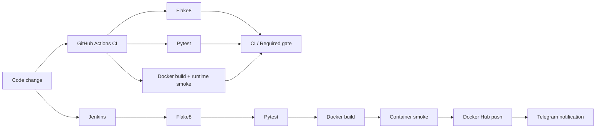

# Jenkins + Docker CI Pipeline

[](https://github.com/TokhirjonYuldoshev/my-docker-project/actions/workflows/ci.yml)

A compact QA/DevOps portfolio project that demonstrates two complementary automation paths:

- **GitHub Actions CI** validates every pull request and push with Flake8, Pytest, Docker build and a container runtime smoke test;
- **Jenkins delivery pipeline** repeats the quality gates, builds and smoke-tests the image, publishes it to Docker Hub and reports the build result to Telegram.

## Automation architecture



## Quality gates

A change is considered technically healthy only when these independent checks pass:

| Gate | What it proves |
| --- | --- |
| Flake8 | Python source and test files satisfy the configured static-quality rules |
| Pytest | The observable application behavior matches the expected contract |
| Docker build | The application can be packaged from the repository state |
| Container runtime smoke | The built image actually starts and returns the expected application output |
| CI / Required gate | All required validation jobs completed successfully |

The container smoke test is deliberately separate from the unit test: a successful unit test does not prove that packaging and container execution are correct.

## Runtime baseline

GitHub Actions and the Docker runtime are standardized on **Python 3.12**. Jenkins requires **Python 3.12 or newer** and fails fast when the available `python` executable is older than that baseline.

The container runs the application as a non-root user. CI dependency installation uses the checked-in pinned development requirements instead of upgrading tooling implicitly during every run.

## GitHub Actions CI

Workflow: `.github/workflows/ci.yml`

Triggers:

- pull requests;
- pushes to `main`;
- manual `workflow_dispatch`.

Flake8, Pytest and Docker validation run as independent jobs. An `always()` aggregate job publishes their outcomes to the GitHub Actions summary and exposes the stable **`CI / Required gate`** check, which fails whenever any required dependency does not succeed. This gives branch protection a single deterministic merge gate without hiding the individual signals.

The workflow uses read-only repository permissions, per-ref concurrency and explicit job timeouts. CI does **not** publish images and does not require Docker Hub or Telegram credentials.

## Jenkins delivery pipeline

The Jenkins Declarative Pipeline executes:

1. checkout source code;
2. verify the Python 3.12+ runtime;
3. install pinned development dependencies;
4. run Flake8;
5. run Pytest;
6. build the Docker image;
7. run the container smoke test;
8. authenticate to Docker Hub through Jenkins Credentials;
9. publish the versioned image;
10. clean up the local image;
11. report the result to Telegram.

Docker cleanup is attempted even when an earlier delivery stage fails. Telegram is treated as an **observability channel**, not as the source of truth for build health: a notification transport failure produces a warning but does not turn an otherwise healthy pipeline into a false product failure.

## Tech stack

| Area | Technology |
| --- | --- |
| CI validation | GitHub Actions |
| Delivery automation | Jenkins Declarative Pipeline |
| Language | Python 3.12 |
| Tests | Pytest 9 |
| Static analysis | Flake8 |
| Containerization | Docker |
| Registry | Docker Hub |
| Notifications | Telegram Bot API |

## Repository structure

```text
my-docker-project/
├── .github/
│   ├── dependabot.yml
│   └── workflows/
│       └── ci.yml
├── .dockerignore
├── .gitignore
├── Dockerfile
├── Jenkinsfile
├── app.py
├── test_app.py
├── requirements-dev.txt
└── README.md
```

## Test scope

The application is intentionally small. The automated unit test verifies the observable message returned by `get_message()`.

This repository demonstrates **quality-gate integration and delivery mechanics**, not a large product test suite. The focus is on making linting, tests, container validation, image publication, cleanup and notifications explicit and repeatable.

## Dependency management

Development tools are pinned in `requirements-dev.txt`:

```bash
python -m pip install --disable-pip-version-check -r requirements-dev.txt
python -m flake8 app.py test_app.py --count --statistics
python -m pytest -q
```

Dependabot checks **Python dependencies**, **GitHub Actions** and the **Docker base image** weekly. Dependency updates are proposed as pull requests rather than auto-merged, so they must pass the same Flake8, Pytest, Docker build and runtime-smoke gates as normal changes. The Docker runtime intentionally stays on the **Python 3.12** line; cross-minor/major runtime upgrades are handled as explicit engineering changes so CI, Docker and Jenkins remain aligned.

## Docker

Build locally:

```bash
docker build -t shoxrux-app .
```

Run locally:

```bash
docker run --rm shoxrux-app
```

Expected output:

```text
Hello from Docker! The application is running successfully.
```

The Jenkins pipeline publishes versioned images using the Jenkins build number as the image tag.

## Secrets and failure semantics

Docker Hub and Telegram credentials are read from **Jenkins Credentials**. Tokens and passwords are not stored in the repository.

Expected Jenkins credential IDs:

```text
docker-hub-credentials
telegram-token
telegram-chat-id
```

A quality, test, build, runtime-smoke or publish failure fails the Jenkins build. Cleanup and notification delivery are auxiliary operations and do not hide the original pipeline result.

---

**Portfolio project by Tokhirjon Yuldoshev**
