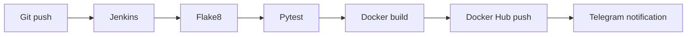

# Jenkins + Docker CI Pipeline

A compact QA/DevOps portfolio project that demonstrates a **Jenkins Declarative Pipeline** for linting, automated tests, Docker image build/push and Telegram build notifications.

## What the pipeline does



Pipeline stages:

1. checkout source code;
2. install pinned development dependencies;
3. run Flake8;
4. run Pytest;
5. build a Docker image;
6. push the image to Docker Hub;
7. remove the local image;
8. report build status to Telegram.

## Tech stack

| Area | Technology |
| --- | --- |
| CI | Jenkins Declarative Pipeline |
| Language | Python 3.9 |
| Tests | Pytest |
| Static analysis | Flake8 |
| Containerization | Docker |
| Registry | Docker Hub |
| Notifications | Telegram Bot API |

## Repository structure

```text
my-docker-project/
├── Dockerfile
├── Jenkinsfile
├── app.py
├── test_app.py
├── requirements-dev.txt
└── README.md
```

## Test scope

The current application is intentionally small. The automated test verifies the observable application message returned by `get_message()`.

This repository demonstrates **pipeline integration and delivery mechanics**, not a large application test suite. The focus is on connecting code quality, tests, container build, registry publication and build notifications into one repeatable Jenkins flow.

## Dependency management

Development tools are pinned in `requirements-dev.txt` and installed by Jenkins:

```bash
python -m pip install -r requirements-dev.txt
python -m flake8 app.py test_app.py --count --statistics
python -m pytest -q
```

## Docker

Build locally:

```bash
docker build -t shoxrux-app .
```

Run locally:

```bash
docker run --rm shoxrux-app
```

The Jenkins pipeline publishes versioned images using the Jenkins build number as the image tag.

## Secrets

Docker Hub and Telegram credentials are read from **Jenkins Credentials**. Tokens and passwords are not stored in the repository.

Expected Jenkins credential IDs:

```text
docker-hub-credentials
telegram-token
telegram-chat-id
```

---

**Portfolio project by Tokhirjon Yuldoshev**
