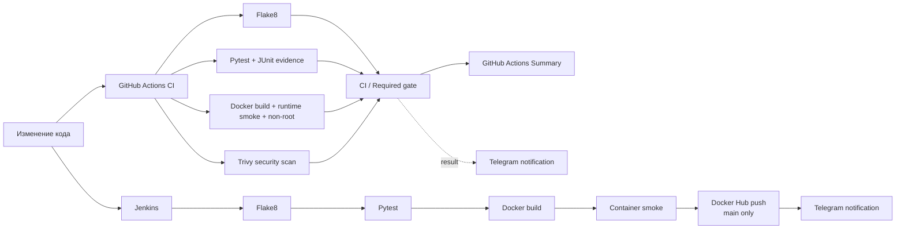

# Jenkins + Docker: CI/CD-пайплайн для QA

[](https://github.com/TokhirjonYuldoshev/my-docker-project/actions/workflows/ci.yml)

Небольшой, но инженерно оформленный QA/DevOps portfolio-проект, который показывает два независимых пути автоматизации качества:

- **GitHub Actions CI** проверяет каждый Pull Request и push в `main` через Flake8, Pytest, Docker runtime smoke, non-root runtime assertion и blocking security gate на Trivy; тот же baseline перепроверяется по weekly schedule, чтобы видеть drift базового image и security state даже без изменения репозитория;
- **Jenkins delivery pipeline** повторяет quality gates, собирает и smoke-тестирует Docker image, а публикацию versioned image в Docker Hub разрешает только из `main`;
- **Telegram observability** для GitHub Actions вынесена в отдельный job и не может подменить реальный CI result.

## Архитектура автоматизации



## Что проверяет CI

| Gate | Что подтверждает |
| --- | --- |
| `Quality / Flake8` | Python-код и тесты проходят статическую проверку |
| `Tests / Pytest` | наблюдаемое поведение приложения соответствует контракту; JUnit XML сохраняется как CI evidence |
| `Docker / Build + runtime smoke` | image реально собирается, контейнер стартует, возвращает ожидаемый результат и объявляет non-root runtime user |
| `Security / Trivy container scan` | в образе нет исправляемых `CRITICAL` уязвимостей по политике проекта |
| `CI / Required gate` | все обязательные сигналы завершились успешно |

Unit test и container smoke разделены намеренно: успешный Pytest не доказывает, что Docker packaging и runtime действительно исправны. Security scan также независим от функциональных проверок, поэтому риск уязвимостей виден отдельным merge-сигналом.

## Runtime baseline

Проект стандартизирован на **Python 3.12** для GitHub Actions и Docker runtime. Jenkins требует **Python 3.12+** и fail-fast завершает pipeline, если агент не соответствует baseline.

Docker container запускает приложение не от `root`; GitHub Actions проверяет это отдельным runtime-policy assertion через metadata собранного image. CI устанавливает только зафиксированные зависимости из `requirements-dev.txt`, без неявного обновления tooling при каждом запуске.

## GitHub Actions CI

Основной workflow: `.github/workflows/ci.yml`.

Триггеры:

- Pull Request;
- push в `main`;
- ручной `workflow_dispatch`;
- weekly baseline validation по воскресеньям в **03:30 UTC**.

Scheduled run намеренно выполняет тот же полный набор gate'ов. Это позволяет поймать изменение mutable Docker base image, новый fixable `CRITICAL` finding или инфраструктурный drift даже когда commit в репозитории не менялся.

Flake8, Pytest, Docker runtime validation и Trivy работают независимыми jobs. Финальный `CI / Required gate` агрегирует их результаты и предоставляет один стабильный сигнал для branch protection. При этом отдельные jobs остаются видимыми для диагностики причины failure.

Pytest формирует JUnit XML, который сохраняется как GitHub Actions artifact на 14 дней. Это отделяет доказательство фактического test execution от консольного лога и делает результат доступным для последующего разбора.

Workflow использует read-only `contents` permission, явные timeouts и concurrency policy. Устаревшие PR-runs могут отменяться, а post-merge и scheduled runs доводятся до конца, чтобы сохранять подтверждение состояния основной ветки и текущего runtime baseline.

## Operational incident response

[`docs/pipeline-incident-runbook.md`](docs/pipeline-incident-runbook.md) фиксирует порядок triage по владельцу сигнала, а не по принципу «перезапустить пока не позеленеет».

Runbook определяет:

- ownership для Flake8, Pytest, Docker runtime, Trivy, aggregate gate, Jenkins publish и Telegram;
- порядок разбора deterministic, delivery-infrastructure и external runner/platform failures;
- severity model и resolution criteria;
- правило максимум одного targeted diagnostic rerun после подтверждённого external recovery;
- anti-patterns: никакого gate weakening, произвольных sleeps/retries или suppress fixable `CRITICAL` findings.

Для фиксации таких случаев есть структурированный `.github/ISSUE_TEMPLATE/pipeline_incident.yml`: issue требует указать owning signal, severity, revision, evidence, reproducibility и impact, а также подтвердить отсутствие секретов и masking-workarounds.

## Telegram-уведомления GitHub Actions

После push в `main`, ручного и weekly scheduled запуска отдельный `Telegram Notification` job отправляет компактный итог:

- общий статус pipeline;
- Flake8 / Pytest / Docker smoke / Trivy / Required gate;
- репозиторий, ветку, автора, event и commit;
- прямую ссылку на конкретный GitHub Actions run.

Уведомление оформляется через Telegram HTML и воспринимается как **observability channel**, а не как источник истины о здоровье сборки. Если Telegram API временно недоступен, реальный CI result не превращается в ложный product failure.

Для GitHub Actions используются repository secrets:

```text
TELEGRAM_BOT_TOKEN
TELEGRAM_CHAT_ID
```

Если secrets отсутствуют, основной CI остаётся зелёным, а notification job явно фиксирует, что отправка пропущена. Для проверки интеграции есть отдельный manual-only workflow `.github/workflows/telegram-test.yml`, который последовательно проверяет `getMe`, `getChat` и `sendMessage` и **падает**, если интеграция настроена некорректно.

## Jenkins delivery pipeline

`Jenkinsfile` выполняет:

1. checkout исходного кода;
2. проверку Python 3.12+;
3. установку pinned development dependencies;
4. Flake8;
5. Pytest;
6. Docker build;
7. container runtime smoke;
8. для `main` — авторизацию в Docker Hub через Jenkins Credentials и публикацию versioned image;
9. cleanup локального image;
10. Telegram notification о результате и publish policy.

Validation stages выполняются независимо от source branch. Docker Hub publish использует **fail-closed branch policy**: stage разрешена только при `BRANCH_NAME=main` или `GIT_BRANCH=origin/main`; неизвестная или feature-ветка image не публикует.

Pipeline отключает неявный Declarative checkout, потому что checkout контролируется отдельной stage. Builds сериализованы, чтобы избежать конфликтов общего Docker/credential state на агенте, история ограничена последними 20 builds, а глобальный timeout не позволяет зависшему delivery занимать executor бесконечно.

Jenkins credentials ожидаются под ID:

```text
docker-hub-credentials
telegram-token
telegram-chat-id
```

Telegram failure в Jenkins не скрывает результат линтинга, тестов, сборки, smoke или публикации image.

## Стек

| Область | Технология |
| --- | --- |
| CI validation | GitHub Actions |
| Delivery automation | Jenkins Declarative Pipeline |
| Язык | Python 3.12 |
| Tests | Pytest 9 |
| Test evidence | JUnit XML artifacts |
| Static analysis | Flake8 |
| Container security | Trivy |
| Containerization | Docker |
| Registry | Docker Hub |
| Notifications | Telegram Bot API |
| Dependency maintenance | Dependabot |

## Структура репозитория

```text
my-docker-project/
├── .github/
│   ├── CODEOWNERS
│   ├── dependabot.yml
│   ├── ISSUE_TEMPLATE/
│   │   └── pipeline_incident.yml
│   ├── pull_request_template.md
│   └── workflows/
│       ├── ci.yml
│       └── telegram-test.yml
├── docs/
│   └── pipeline-incident-runbook.md
├── .dockerignore
├── .gitattributes
├── .gitignore
├── .python-version
├── CONTRIBUTING.md
├── Dockerfile
├── Jenkinsfile
├── SECURITY.md
├── app.py
├── test_app.py
├── requirements-dev.txt
└── README.md
```

`CONTRIBUTING.md` фиксирует change/validation policy, `SECURITY.md` — security boundaries и работу с секретами, `CODEOWNERS` делает ownership критичных CI/CD-файлов явным, а incident runbook и issue form задают единый operational triage contract.

## Test scope

Приложение намеренно небольшое. Unit test проверяет observable contract функции `get_message()`.

Цель проекта — не искусственно увеличивать количество тестов, а продемонстрировать **качество pipeline design**: статический анализ, test gate, сохраняемое test evidence, Docker packaging, runtime verification, non-root policy, container security, controlled delivery, cleanup, observability и operational incident response.

## Dependency management

Development tools зафиксированы в `requirements-dev.txt`:

```bash
python -m pip install --disable-pip-version-check -r requirements-dev.txt
python -m flake8 app.py test_app.py --count --statistics
python -m pytest -q
```

Dependabot проверяет Python dependencies, GitHub Actions и Docker base image по расписанию. Обновления приходят Pull Requests и проходят те же quality gates, что обычные изменения. Major/runtime upgrades не auto-merge: compatibility должна быть доказана CI.

## Локальный Docker smoke

Сборка:

```bash
docker build -t shoxrux-app .
```

Запуск:

```bash
docker run --rm shoxrux-app
```

Ожидаемый результат:

```text
Hello from Docker! The application is running successfully.
```

## Security и failure semantics

- secrets и пароли не хранятся в репозитории;
- Trivy — отдельный blocking signal для fixable `CRITICAL` container vulnerabilities;
- Docker image публикуется Jenkins только из подтверждённой `main` branch;
- quality/test/build/runtime/security/publish failures не маскируются notification или cleanup-логикой;
- notification transport — вспомогательный observability signal;
- weekly baseline validation перепроверяет mutable runtime/security state без необходимости ждать code change;
- политика раскрытия security-проблем описана в `SECURITY.md`;
- contribution/validation policy описана в `CONTRIBUTING.md`;
- ownership ключевых automation-файлов зафиксирован в `.github/CODEOWNERS`;
- PR template заставляет явно оценивать CI/runtime/security risk изменения;
- operational triage и severity model зафиксированы в `docs/pipeline-incident-runbook.md` и incident issue form.

## Почему это QA-проект

Здесь проверяется не только код функции. Проект демонстрирует инженерный контроль качества delivery chain: независимые quality gates, deterministic aggregate result, retained test evidence, runtime smoke после сборки контейнера, non-root runtime policy, security scanning, dependency maintenance, scheduled baseline revalidation, controlled main-only publishing, failure semantics, incident response и диагностируемые уведомления.

---

**Portfolio project by Tokhirjon Yuldoshev**
